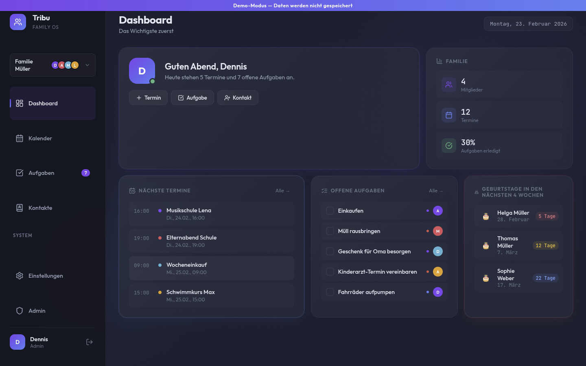
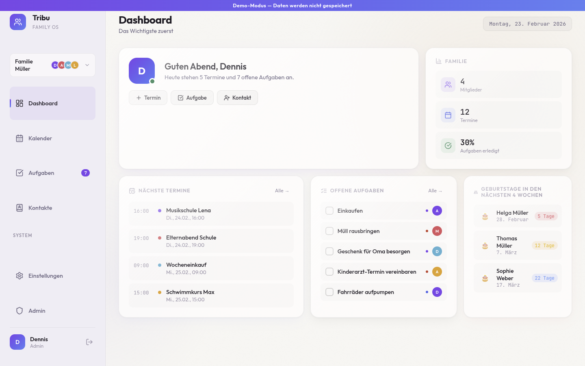
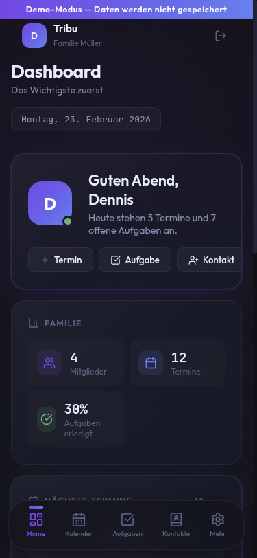

<p align="center">
  
</p>

<h1 align="center">Tribu</h1>

<p align="center">
  <strong>Self-hosted family organizer to tame the everyday chaos.</strong><br>
  Calendars, tasks, contacts, birthdays &mdash; one place, your server, your data.
</p>

<p align="center">
  <a href="#quick-start">Quick Start</a>&nbsp;&nbsp;&bull;&nbsp;&nbsp;
  <a href="https://github.com/itsDNNS/tribu/wiki">Wiki</a>&nbsp;&nbsp;&bull;&nbsp;&nbsp;
  <a href="CONTRIBUTING.md">Contributing</a>&nbsp;&nbsp;&bull;&nbsp;&nbsp;
  <a href="docs/ROADMAP.md">Roadmap</a>&nbsp;&nbsp;&bull;&nbsp;&nbsp;
  <a href="docs/CHANGELOG.md">Changelog</a>
</p>

---

<p align="center">
  
</p>

<p align="center">
  <em>Midnight Glass theme &mdash; glassmorphism, bento grid dashboard, mesh background</em>
</p>

<details>
<summary><strong>More screenshots</strong></summary>

<br>

**Morning Mist (light theme)**



**Mobile (375px)**

<p align="center">
  
</p>

See the [Wiki](https://github.com/itsDNNS/tribu/wiki) for screenshots of every view and theme.

</details>

---

## Why Tribu?

Most family organizer apps lock your data in their cloud and charge monthly fees. Tribu runs on your own hardware, gives you full control, and costs nothing.

- **Privacy first** &mdash; all data stays on your server, no third-party services
- **Modular** &mdash; each feature is an isolated plugin, extend what you need
- **Beautiful** &mdash; three polished themes with glassmorphism, animations, and responsive design
- **Bilingual** &mdash; German and English out of the box, lazy-loaded per module
- **Try before you install** &mdash; interactive demo mode with realistic sample data, no backend needed

## Features

| | |
|---|---|
| **Dashboard** | Bento grid with today's events, open tasks, birthday countdowns, and family stats |
| **Calendar** | Month/week view, event dots, day-detail panel, quick event creation |
| **Tasks** | Priorities, due dates, assignees, recurring tasks, overdue tracking |
| **Contacts** | Card grid with colored avatars, CSV import, automatic birthday extraction |
| **Birthdays** | 4-week lookahead with countdown, auto-synced from contacts |
| **Themes** | Morning Mist (light), Dunkel (dark), Midnight Glass (glassmorphism) |
| **Security** | httpOnly cookies, rate limiting, PBKDF2-SHA256, non-root containers, CORS locked down |

## Quick Start

```bash
git clone https://github.com/itsDNNS/tribu.git
cd tribu/infra
cp .env.example .env
```

Generate secrets and fill in `.env`:

```bash
openssl rand -hex 32    # JWT_SECRET
openssl rand -hex 16    # POSTGRES_PASSWORD
```

Start the stack:

```bash
docker compose up --build
```

| Service | URL |
|---------|-----|
| Frontend | [localhost:3000](http://localhost:3000) |
| Backend API | [localhost:8000](http://localhost:8000) |
| Swagger Docs | [localhost:8000/docs](http://localhost:8000/docs) |

> The first user to register becomes the family **admin**.
>
> Want to explore first? Click **Demo ausprobieren** on the login page.

## Tech Stack

**Frontend:** Next.js 14, React 18, Lucide Icons, CSS custom properties<br>
**Backend:** FastAPI, SQLAlchemy, Python 3.12+<br>
**Database:** PostgreSQL 16<br>
**Deployment:** Docker Compose (Redis 7 prepared for realtime features)

## Documentation

| | |
|---|---|
| [Wiki](https://github.com/itsDNNS/tribu/wiki) | Product plan, market analysis, all screenshots |
| [Architecture](docs/ARCHITECTURE.md) | Backend modules, frontend patterns, security, API reference |
| [Plugin Spec](docs/PLUGIN-MANIFEST.md) | How to build feature, theme, and language plugins |
| [Roadmap](docs/ROADMAP.md) | Development phases and planned features |
| [Contributing](CONTRIBUTING.md) | Dev setup, project structure, PR guidelines |
| [Security](SECURITY.md) | Security policy and responsible disclosure |
| [Changelog](docs/CHANGELOG.md) | Release history |

## License

Private project. All rights reserved.

---

<p align="center">
  Built with care by the <a href="https://github.com/itsDNNS">itsDNNS</a> family.
</p>
